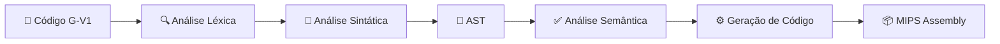

# Compilador G-V1


Este projeto é um compilador didático para a linguagem **G-V1**, desenvolvido como parte da disciplina de Compiladores do Instituto de Informática da Universidade Federal de Goiás (UFG).

O compilador traduz códigos escritos em G-V1 para a linguagem assembly **MIPS**, pronta para ser executada em simuladores como o SPIM ou MARS.

---

## 🔄 Pipeline de Compilação


---

## 🚀 Funcionalidades

| Etapa | Ferramenta | Descrição |
|---|---|---|
| **Análise Léxica** | Flex | Reconhecimento de tokens, palavras reservadas e tratamento de caracteres inválidos. |
| **Análise Sintática** | Bison (LALR/GLR) | Validação gramatical e construção da AST. |
| **AST** | — | Representação hierárquica compacta do programa na memória para facilitar a análise e tradução. |
| **Tabela de Símbolos** | Pilha de Hash Tables | Gerenciamento de escopos aninhados, garantindo visibilidade correta das variáveis. |
| **Análise Semântica** | — | Checagem de tipos estrita (Type Checking) e verificação de declarações prévias. |
| **Geração de Código** | — | Tradução direta da AST para MIPS Assembly seguindo o modelo de máquina de pilha. |

---

## 🛠️ Pré-requisitos

- GCC/G++ 14
- Flex 2.6.4
- Bison 3.8.2
- Make 4.3+

---

## 📦 Como Compilar e Rodar

**1. Compile o projeto usando o Makefile:**
```bash
make
```

**2. Execute o compilador passando um arquivo de entrada:**
```bash
./g-v1 teste.gv1
```

**3. Redirecione a saída MIPS para um arquivo:**
```bash
./g-v1 teste.gv1 > saida.s
```

**4. Rode no simulador SPIM:**
```bash
spim -file saida.s
```

---

## 📂 Estrutura do Projeto
```
g-v1/
├── g-v1.l               # Especificação léxica (Flex)
├── g-v1.y               # Gramática e ações sintáticas (Bison)
├── ast.c / ast.h        # Implementação da Árvore Sintática Abstrata
├── tabela_simbolos.c/h  # Lógica de escopo e hash table
├── semantico.c/h        # Regras de análise semântica
├── gerador.c/h          # Tradutor para MIPS Assembly
└── Makefile             # Automação do processo de build
```